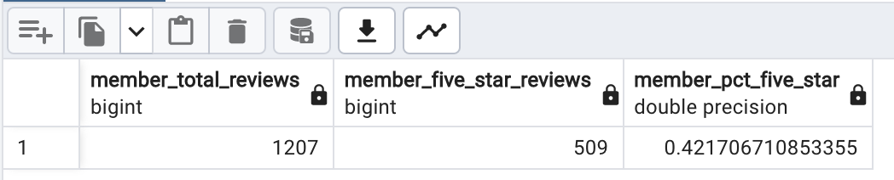
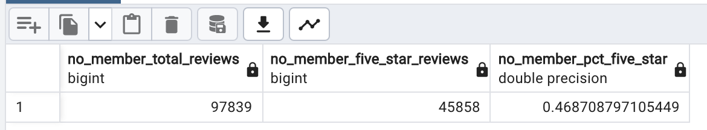

# Amazon_Vine_Analysis
## Analysis Overview 
This project analyzes the Amazon vine program and determines if there's any bias towards favorable reviews from the members.

## Resources 
[Amazon Kitchen Reviews ](https://s3.amazonaws.com/amazon-reviews-pds/tsv/amazon_reviews_us_Kitchen_v1_00.tsv.gz)

## Results  

### Members 
- Total Reviews: 1207 
- Five Start Reviews: 509 
- Memeber Pct 5 Star Reviews: 42% 

### Non-members 
- Total Reviews: 97839 
- Five Start Reviews: 45858  
- Memeber Pct 5 Star Reviews: 46% 

## Summary 
There does not seem to be a positive bias in fact, with the kitchen reviews. It appears that non-members have given five star ratings in a slightly higher percentage of the time. Given the closeness 46% and 42% there would appear to be no significant difference between being a member or a non-member in this particular category i.e. kitchen products. 

Additionally, we could analyze the distribution of the star ratings to see how closely they align (mean, median, mode). 

## Additional Charting 
Pulling data into Tableau the overall data was charted betwen member and non-member with no filter of the data. There appears to be a difference in how likely members are to give other than a rating of 5. Members would appear to be more likely to give 4 ratings than non-members. 
### Member Bar Chart 

### Non-member Bar Chart 
